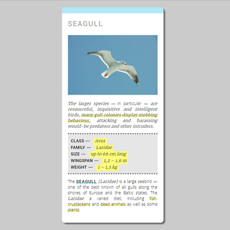
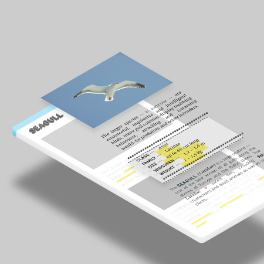

# Animal Trading Card

**Animal Trading Card**
Student Project #3 during Google Front-End Development Nanodegree Program at Udacity

[See full project](https://dominicom.github.io/animal-trading-card/)

## Table of Contents

* [About the project](#about-the-project)
* [Contributing](#contributing)

## About the project
This is #1 student project made for Udacity classroom on Front-End Web Developer track.

#### Screenshots

#### Starter Project
> GitHub:
> link - https://github.com/udacity/fend-animal-trading-cards/

>Package ZIP:
> link - https://github.com/udacity/fend-animal-trading-cards/archive/master.zip

This is a common workflow for front-end web developers. Typically, provided with a design prototype that needs to be translated to an actual, functional website.

The design prototype used in this project is inspired by trading cards and features a fish you might recognize from a popular animated film. The task is to create the card and swap out the fish with an animal of student's choice.

#### Project Instructions
1.  Replace the placeholder image in  `card.html`  and information with your favorite animal's image and information. For the image, you will want to use an image with a  `width`  of 300 pixels. If your image is larger, you can set the image's width to 300 pixels in your CSS, but be aware that your image might end up squished or distorted. Also, don't forget to change the image's  `alt`  attribute to the name of your animal. So,  `alt="name-of-your-animal"`  should be replaced with the actual name of your animal.

2.  Add the favorite animal's image and information, add the proper CSS to  `styles.css`  to recreate the  `design-prototype.png`  by applying the style rules in step 4. You’ll need to modify  `card.html`  to include  `attributes`  and use  `selectors`  to specify the elements you want to style. Also, make sure to link to your stylesheet in  `card.html`  or else your CSS will not be applied to your webpage.
3.  The CSS should apply these styles to match the design prototype:
    -   italicized text for the animal's interesting fact
    -   bolded labels for the animal's list items (e.g. 'Habitat')
    -   no dots for the animal's list items
    -   border around the animal's name, image, and information
    -   border around the animal's information
    -   spacing between the animal's name, image, and information (you will need to use the property  [padding](https://developer.mozilla.org/en-US/docs/Web/CSS/padding))

#### External Assets
Original photo by [**Koji Kawano**](http://kkimagery.com/)
> link http://kkimagery.com/wp-content/uploads/2012/06/Seagull.jpg

## Contributing

This repository is the starter code for _all_ Udacity students. Therefore, we most likely will not accept pull requests.

For details, check out [CONTRIBUTING.md](CONTRIBUTING.md).
